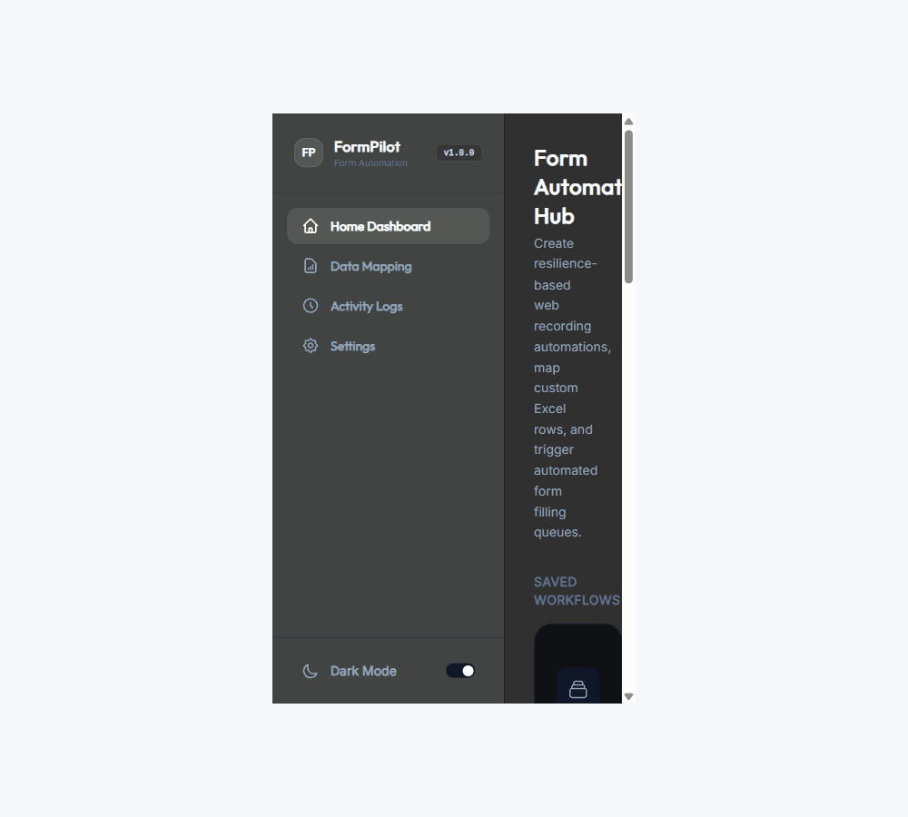
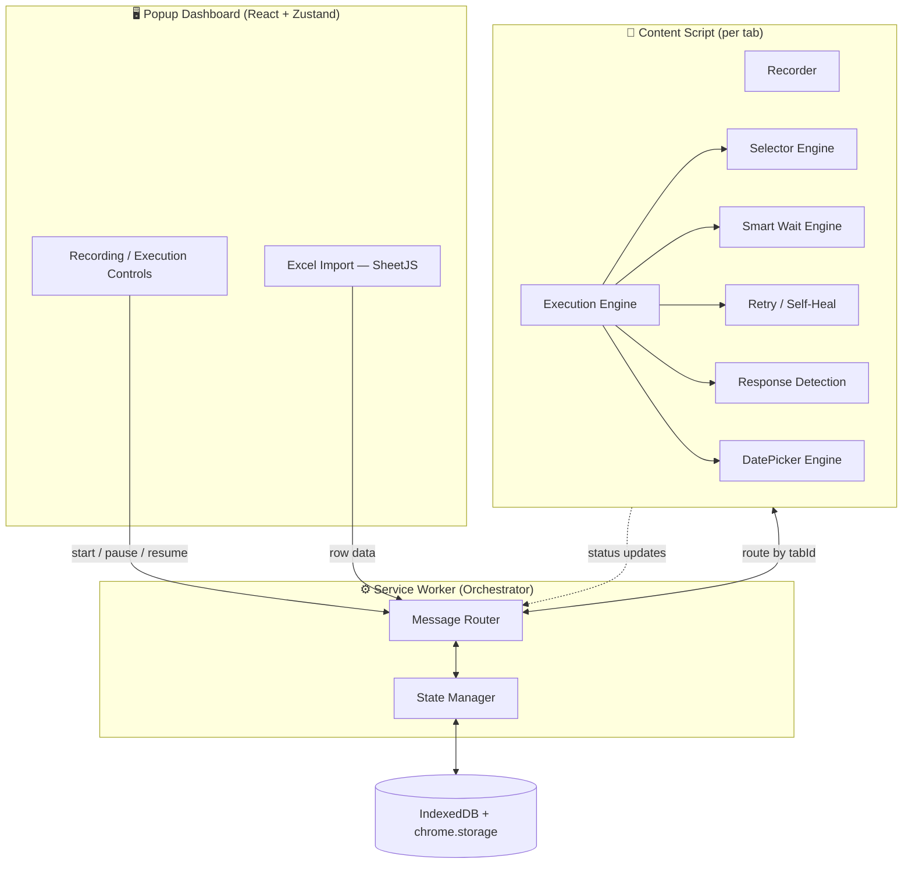

<div align="center">

# 🧭 FormPilot

### Resilient, multi-page form automation for Chrome — powered by recordings and Excel

Automate the tedious stuff on real-world, dynamic, government-grade web forms.
Record once. Feed it a spreadsheet. Let it fly across hundreds of rows and multi-page flows — with self-healing selectors that don't break the moment a site changes its DOM.

[](https://developer.chrome.com/docs/extensions/mv3/intro/)
[](https://www.typescriptlang.org/)
[](https://react.dev/)
[](LICENSE)
[](#contributing)

`Sachin-Rawal091/FORMPILOT`

</div>

---

## 🎬 See it in action

<div align="center">



_Record a form once → Upload your Excel → Hit Run → Watch it fly through hundreds of rows._

</div>

---

## Why FormPilot exists

Most "form filler" extensions are built for static HTML forms and die the moment they meet a real SPA — React-driven fields, AJAX-loaded steps, custom date pickers, or a multi-page "Save & Continue" flow like you'd find on a government portal.

FormPilot is built for exactly that environment:

- **Record** a real user session interacting with a form — clicks, inputs, date picker selections, page transitions.
- **Map** each field to a column in an Excel sheet.
- **Replay** the recording once per row, across as many pages and sessions as the form requires — resuming cleanly even if a tab closes mid-flow.

It's designed to survive the things that break naive automation: elements that mount late, selectors that go stale, network calls that haven't resolved yet, and third-party UI widgets (like custom date pickers) that don't behave like plain `<input>` fields.

---

## ✨ Core Engines

FormPilot isn't one script — it's a set of purpose-built subsystems that each own one hard problem:

| Engine                           | What it solves                                                                                                                        |
| -------------------------------- | ------------------------------------------------------------------------------------------------------------------------------------- |
| 🎯 **Selector Engine**           | 8-strategy fallback selector pipeline with Shadow DOM piercing, so a single DOM tweak on the target site doesn't break the whole flow |
| ⏱ **Smart Wait Engine**          | Waits on DOM readiness, network idle, and `MutationObserver` signals instead of hardcoded `sleep()` calls                             |
| ⚙️ **Execution Engine**          | A step-based state machine that drives the replay, one deterministic step at a time                                                   |
| 🔁 **Retry & Self-Heal System**  | Detects failed steps and retries with adjusted strategy before giving up                                                              |
| 💾 **State Manager**             | Persists execution progress so multi-page "Save & Continue" flows can pause, resume, or survive a browser restart                     |
| 📡 **Response Detection Engine** | Understands what the page did after an action — success, validation error, navigation, or silent failure                              |
| 🗓 **DatePicker Engine**         | Adapter-based registry (`RmdpAdapter`, `MuiAdapter`, `AntDAdapter`, generic fallback) for handling non-native date widgets            |
| 📝 **Logging System**            | Structured, queryable logs of every step, retry, and decision — built for debugging production runs, not just demos                   |

Each engine is isolated behind a clear interface, so adding support for a new date-picker library or a new wait condition doesn't mean touching the rest of the system.

---

## 🏗 Architecture

FormPilot works within Manifest V3's constraints deliberately — the service worker orchestrates and persists state, while the content script owns the actual long-running DOM automation (since MV3 service workers can be killed at any time).



**Key architectural decisions:**

- **Content script owns execution, not the service worker.** MV3 service workers are ephemeral and can't reliably run long automation loops — so once a run starts, the content script drives it and reports state back.
- **No hardcoded delays.** Every wait is a condition (DOM mutation, network settle, element visibility) resolved by the Smart Wait Engine, not a `setTimeout` guess.
- **Adapter pattern for third-party widgets.** Rather than special-casing every date picker library in the execution engine, `DatePickerAdapter` implementations are registered and resolved per-field.

---

## 🛠 Tech Stack

- **TypeScript** — strict typing across the entire codebase
- **React + Zustand** — popup dashboard UI, domain-sliced state
- **Vite + @crxjs/vite-plugin** — MV3-aware build tooling with working HMR
- **IndexedDB** (via a custom `StorageManager`) + `chrome.storage` — recordings, run history, resumable state
- **SheetJS** — Excel (`.xlsx`) parsing for input data
- **Manifest V3** — service worker + content scripts, no persistent background page

---

## 🚀 Getting Started

### Prerequisites

- Node.js 18+
- npm or pnpm
- Google Chrome (or any Chromium-based browser)

### Installation

```bash
git clone https://github.com/Sachin-Rawal091/FORMPILOT.git
cd FORMPILOT
npm install
npm run dev        # starts Vite in watch mode with HMR
```

### Load into Chrome

1. Open `chrome://extensions`
2. Enable **Developer mode** (top right)
3. Click **Load unpacked**
4. Select the `dist/` folder generated by the build

### Production build

```bash
npm run build
```

---

## 📋 Usage

1. **Record** — Open the FormPilot popup on the target form and start a recording. Interact with the form exactly as a normal user would, including any multi-page "Save & Continue" steps.
2. **Map fields to Excel** — Import your `.xlsx` file and map each recorded field to a spreadsheet column.
3. **Run** — Start execution. FormPilot replays the recording once per row, using the Selector, Wait, and Retry engines to handle timing and DOM variance automatically.
4. **Monitor & resume** — Track progress from the dashboard. If a run is interrupted, resume from the last confirmed step rather than starting over.

---

## 📁 Project Structure

```
formpilot/
├── src/
│   ├── background/        # Service worker — orchestration, routing
│   ├── content/            # Content script — recorder, executor
│   ├── datepicker/         # DatePicker adapter registry & engine
│   ├── popup/               # React dashboard (Zustand domain slices)
│   └── shared/              # Message contracts, shared types
├── tests/                   # Unit tests — the authoritative interface contract
├── public/
│   └── manifest.json
└── vite.config.ts
```

---

## 🗺 Roadmap

FormPilot is under active development, tracked against an internal production-readiness audit.

- [x] Core execution pipeline (Selector, Wait, Execution, Retry, State, Response, Logging engines)
- [x] DatePicker adapter architecture with pluggable registry
- [x] Multi-page "Save & Continue" resumable flows
- [x] MUI & Ant Design date-picker adapters
- [x] AES-GCM encryption at rest for stored spreadsheet data and files
- [x] Confirmation dialog for destructive spreadsheet actions

## Future Development

- [ ] Site Whitelist mode for domain-restricted execution
- [ ] Dashboard UI/UX refresh

Contributions toward any of these are very welcome — see below.

---

## 🤝 Contributing

Contributions, bug reports, and feature requests are welcome.

1. Fork the repo
2. Create a branch: `git checkout -b feature/your-feature`
3. Commit your changes with clear messages
4. Open a PR describing what changed and why

If you're fixing a bug in one of the core engines, please add or update the corresponding test in `tests/` — they're treated as the source of truth for interface behavior.

## ⚠️ Disclaimer

FormPilot automates interactions with third-party websites, including forms that may require accurate, sensitive, or legally significant data (e.g. government portals). Use it responsibly, review every automated run, and ensure you have the right to submit data on the relevant platform. The maintainers are not responsible for misuse.

---

## 📄 License

FormPilot is open-source software licensed under the [MIT License](LICENSE).

<div align="center">

**If FormPilot saves you from clicking through the same form 200 times, consider giving it a ⭐**

</div>
